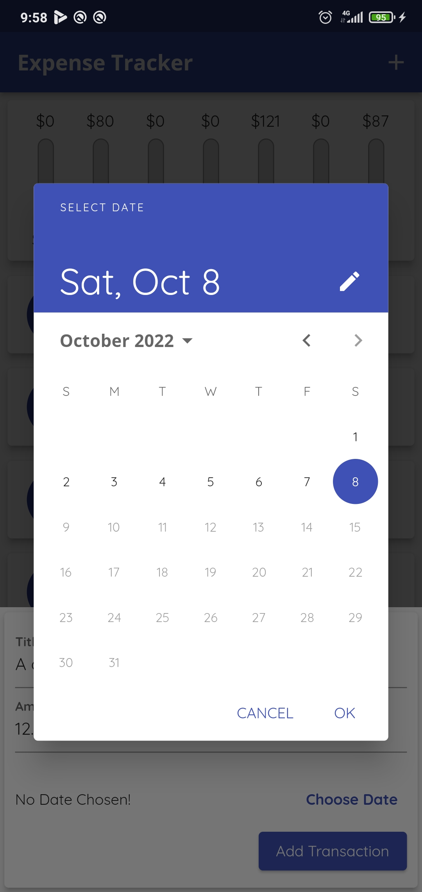

# expense_tracker
Hello 👋,   
This is my first Flutter project.  
It's still pretty silly, but I'm happy with it !!

## Getting Started 🚀
This project is a starting point for a Flutter application.

---

## Screenshots
### 1. Portrait 🌈

  
  
  
  

### 2. Landscape 🌈

  
  

